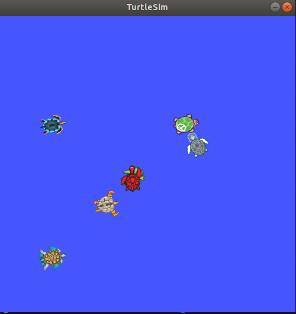

# 第三节 ROS Services

其实Topic是一种通信方式，卖家只管把东西放淘宝上，别人买不买是另一回事。买家只管看淘宝有没有自己想要的东西，有就买，那些跟自己无关的商品也不会去管。这种通信是解耦的，独立的。但显示中还有另外一种通信方式，比如两个人打电话，不可能自己把要说的话一口气说完就挂断电话不管了，而是等对方说完，自己再说。这种要等对方回应完再继续的通信方式就是下一节要说的Services 通信方式。

对应到机器人，比如说机器人视觉蔽障，那就要等摄像头数据来了自己才能走下一步，不能摄像头模块自己处理自己的数据，运动模块也自己动自己的。

### 1. ROS Services

Services 是节点间通信的另外一种通信方式，Services 运行节点发送请求并接受响应。

### 2. 常用命令

ROS Services常用的命令有：

```bash
rosservice list         # 显示当前打开的services列表
rosservice call         # 发起响应
rosservice type         # 显示 service 的类型，类似Messages
rosservice find         # 根据类型查找 service
rosservice uri          # 显示服务端的 service 的rui
```

### 3. 操作

下面我们打开海龟的界面，命令和之前一样，在两者终端依次输入：

```bash
roscore
rosrun turtlesim turtlesim_node
```

下面新开一个终端，依次输入（善于用tab补全）

```
rosservice list
rosservice type /clear
```

输出如下：


再打开一个终端，输入

```bash
rosrun turtlesim turtle_teleop_key
```

此时按下键盘上的箭头，发现出现海龟的运动轨迹。那么怎么清除轨迹呢？很简单，输入

```bash
rosservice call /clear
```

一山容不下二虎，但二龟没问题。下面再做一个小实验，再在背景上复制一只海龟：

首先运行

```bash
rosservice type /spawn | rossrv show
```

```rosservice type /spawn```产生的结果，再送入 ```rossrv show```显示。

返回结果如下：

```bash
float32 x
float32 y
float32 theta
string name
---
string name
```

这是服务的形式，相当于给出 ```x, y, theta, name```四个参数进行请求，返回的一个string类型的name。如果请求的name为空，则会给出默认的名字。

先运行下面代码，看效果：

```bash
rosservice call /spawn 2 2 0.2 ""
```

看看背景上是不是多了一只海龟。

再来一波：

```bash
rosservice call /spawn 4 4 0.2 "lovely_turtle"
```

我的运行多次，效果如下：



可以组成一个大家庭了。以上便是本节内容，如果你要接着看下一节，那就先不要关闭各个终端，马上要用。

### 4. 总结

本节关键理解 services 这种通信方式，想想我们的小海龟是怎样被生产出来的，能用Topics做吗？用Topics那就会不管有没有要求源源不断地生产海龟了！！！

对于上面的一个 *rossrv* 命令，可能有疑问，和Topics做对比吧：Topics - Services， rosmsg - rossrv，也就是说，查看Topics类型的具体内容，用 rosmsg，查看 Services的具体内容，用 rossrv，前者的内容是无返回值的，后者是有返回值的，“---”下面的部分。

下一节，讲一个很简单的 ROS Parameters。

